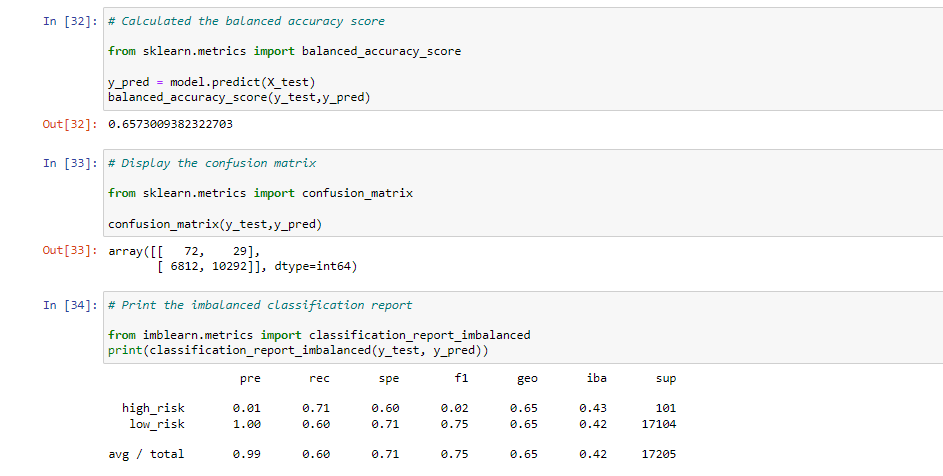

# Credit Risk Analysis

## Overview

In this module, I helped Jill in analysing  credit card credit dataset from LendingClub in order to find out good loans and bad loans. For this analysis, I used machine learning models to predict credist risk. I used a total of six different models and checked which model gave the best result. The machine learning models I used are RandomOverSampler, SMOTE, ClusterCentroids, SMOTEENN, BalancedRandomForestClassifier and EasyEnsembleClassifier. I calculated balanced accuracy scores and the precision and recall scores of all six machine learning models to reach an informed decision. 

## Results

- Random Oversampling:

The balanced accuracy score for this model is 0.6573. The model is not very precise when it comes to predicting high risk lows. Recall for high risk is 0.71 which is also not very good. 

- SMOTE Oversampling:

The balanced accuracy score for this model is 0.6622 which is very similar to the previous model. Precision and recall values are also similar to the previous model.

- Undersampling:

The balanced accuracy score for this model is 0.5645897 which is lower than the previous models. Precision and recall values are  similar to the previous models.

- SMOTEENN - Combination (Over and Under) Sampling:

The balanced accuracy score for this model is 0.64471. Precision and recall values are  similar to the previous models.

- Balanced Random Forest Classifier

The balanced accuracy score for this model is 0.7885 which is considerably higher than the previous models we have seen. Precision is just a tiny bit higher than the previous models but it is still very low with a value of 0.03. Recall value is similar to the previous models. 

- Easy Ensemble AdaBoost Classifier:

The balanced accuracy score for this model is 0.93166 which is the highest amongst all the models. Precision and recall values of this model are also the highest.

## Summary

From the results, we can see that the highest balanced accuracy score (0.93166) is for Easy Ensemble AdaBoost Classifier. The precision and f1 scores for predicting high risk loans is still very low. Low precisions means that there are many fasle positives. This means that many people who were actually low risks were predicted hish risks and therfore might have been rejected. I would conclude by saying that a model other than these 6 models should be used. 

